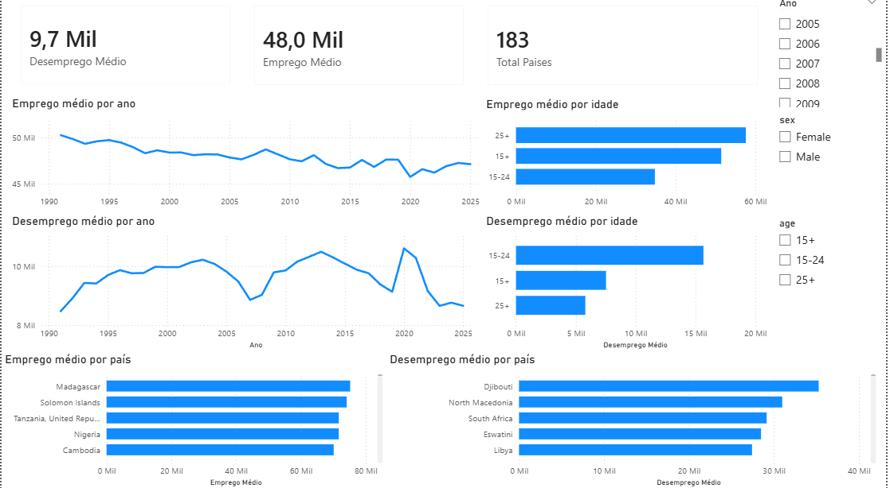

Dashboard

#  Análise Global de Emprego e Desemprego (1991–2025)

##  Sobre o Projeto

Este projeto tem como objetivo analisar a evolução das taxas de **emprego e desemprego ao longo do tempo**, utilizando dados globais entre os anos de 1991 e 2025.

O dashboard foi desenvolvido no Power BI com foco em gerar insights relevantes sobre o mercado de trabalho mundial, permitindo identificar tendências, padrões e comparações entre países e faixas etárias.

---

##  Objetivos da Análise

* Analisar a evolução do desemprego ao longo dos anos
* Identificar quais faixas etárias são mais impactadas
* Avaliar o comportamento do emprego ao longo do tempo

---

##  Ferramentas Utilizadas

* Power BI
* Power Query
* DAX

---

##  Estrutura dos Dados

O dataset contém informações sobre:

* País (`country`)
* Ano (`year`)
* Faixa etária (`age`)
* Sexo (`sex`)
* Taxa observada (`obs_value`)

Os dados foram organizados em duas tabelas principais:

* **Desemprego (disoccupazione)**
* **Emprego (occupazione)**

---

##  Principais Análises

###  Desemprego ao longo do tempo

Visualização da evolução da taxa de desemprego global ao longo dos anos.

###  Comparação por país

Ranking dos países com maiores taxas de desemprego.

###  Análise por faixa etária

Comparação do impacto do desemprego entre diferentes grupos de idade.

###  Emprego ao longo do tempo

Análise da evolução das taxas de emprego ao longo dos anos.

---

##  Insights Obtidos

* A taxa de desemprego apresenta variações significativas ao longo do tempo
* Países em desenvolvimento tendem a apresentar taxas mais elevadas
* Jovens (15–24 anos) são mais impactados pelo desemprego
* O emprego apresenta tendência mais estável em comparação ao desemprego

---

##  Conclusão

Este projeto demonstra a importância da análise de dados na compreensão de tendências econômicas globais, permitindo identificar padrões relevantes para tomada de decisão.

---

##  Sobre mim

Estou em processo de desenvolvimento na área de dados, com foco em análise e visualização utilizando Power BI.

Busco transformar dados em insights claros e objetivos para apoiar decisões de negócio.

---
